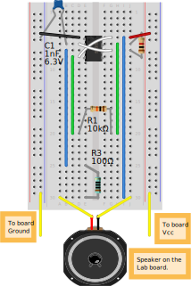
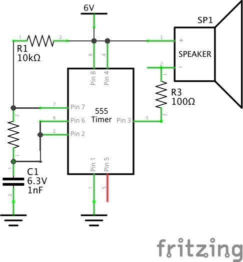

# 555 "Black Box" Circuit

## Overview
This is the design for a standalone version of the 555 "Black Box" test circuit that's used throughout the Radio Shack Electronics Learning Lab Workbook #1 (outlined on page 19).

Rather than keep the untidy circuit in place on the board, I've extracted it to its own small breadboard and wired it to easily replace R1, R3, C1, and attach to Pin 5 (Control Voltage) to conduct various experiments.  I also custom cut wires to sit flush on the board so as to reduce clutter and make an overall smaller profile.

## Schematics

### Illustration

### Schematic

